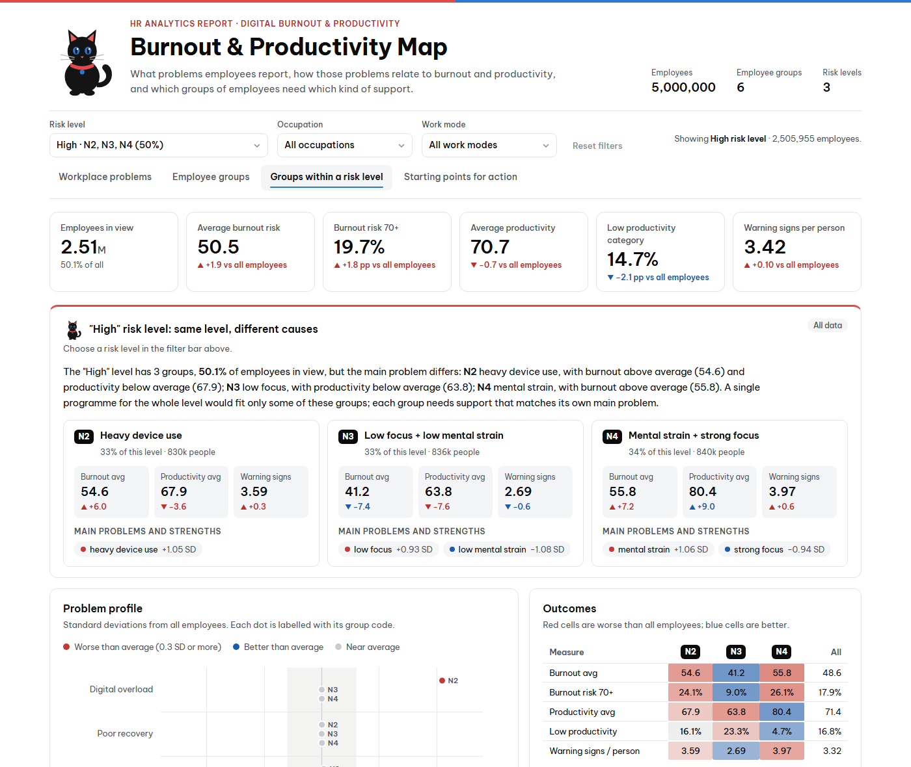
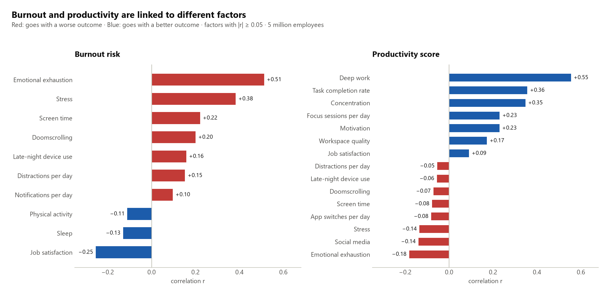
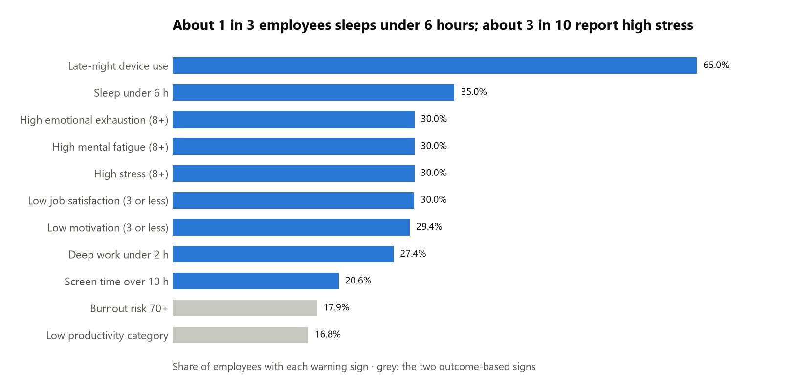
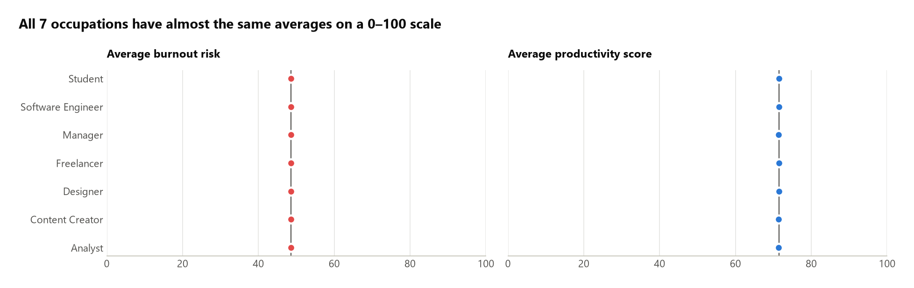
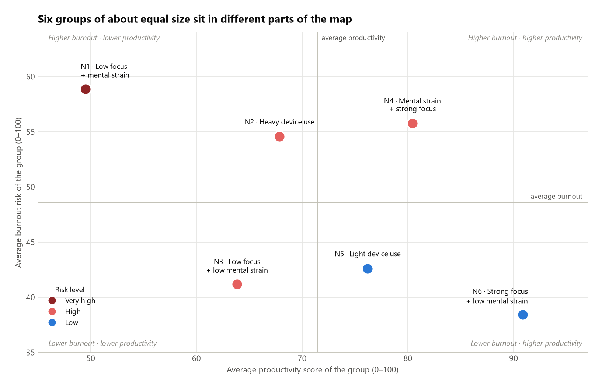
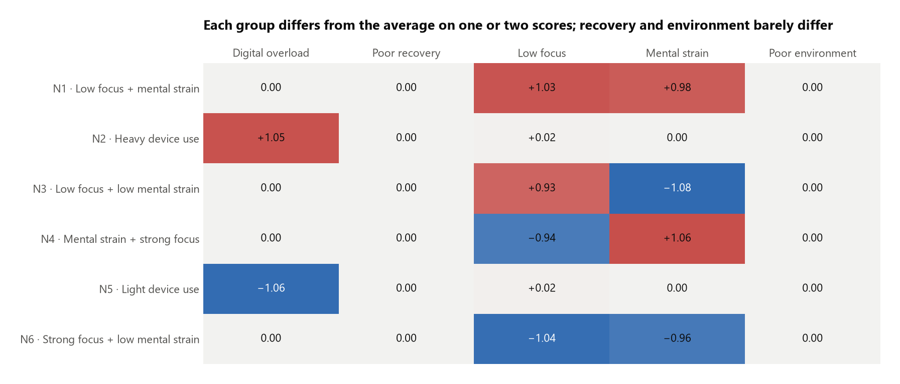
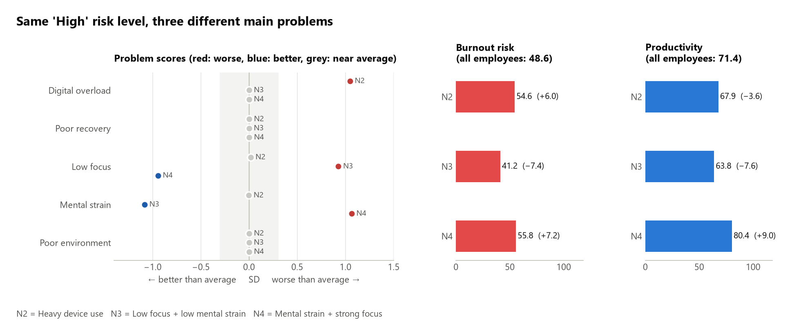
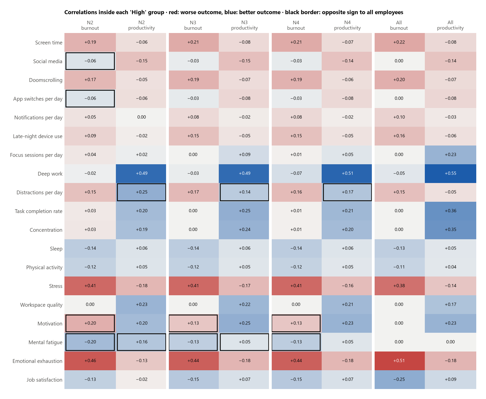
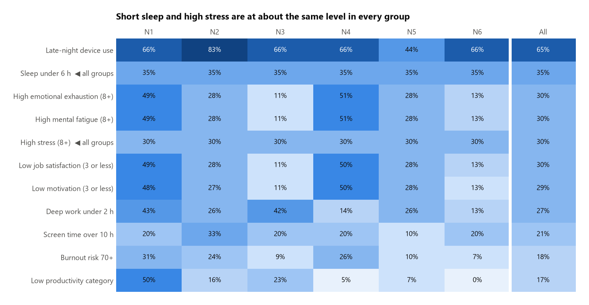

# Burnout and Productivity: What 5 Million Employee Records Show

An end-to-end analysis of 5 million employee records. It looks at which workplace problems go together with burnout
and low productivity, groups employees by the problems they share, and turns each group into a starting point for
action.

| Deliverable | What it is |
|---|---|
| [Analysis notebook](project_employee%20performance%20analysis.ipynb) | Every step of the analysis, one step per cell, with the output shown under each cell |
| [Interactive report](visualize/report.html) | A four-sheet dashboard with filters. GitHub cannot display HTML, so download the file and open it in a browser |
| [Excel report](visualize/report.xlsx) | The same findings as live tables, charts and formulas |
| [Phase 2 report](phase2/PHASE2_REPORT.md) | Lifestyle profile of each group, root-cause analysis and personal routines with cost and benefit, with 38 cited sources |
| [Phase 2 notebook](phase2/phase2_lifestyle_root_causes.ipynb) | The data work behind Phase 2 |
| [Follow-up survey](phase2/survey_questionnaire.md) | A questionnaire to test the root-cause hypotheses with real employees |



> **About the data.** The dataset is synthetic (the Kaggle author says so), and some patterns in it would be unusual
> in real HR data. The numbers below show what the method finds. They are not claims about real employees.

---

## Summary

1. **Burnout and productivity are linked to different factors.** Burnout risk goes with emotional exhaustion
   (r = 0.51) and stress (0.38). Productivity goes with deep work (0.56) and task completion (0.36). Reducing burnout
   is unlikely to raise productivity on its own, and the reverse.
2. **Problems are common and they add up.** 65% of employees use devices late at night, 35% sleep under 6 hours,
   and about 30% report high stress or high emotional exhaustion. The average employee has 3.3 of 11 warning signs,
   and 42% have 4 or more.
3. **Job title and work mode make almost no difference.** Average burnout differs by 0.05 points (out of 100)
   between occupations. The differences are in individual behaviour.
4. **Six employee groups explain 37% of the variation in productivity.** The highest-risk group (N1, 17% of
   employees) combines low focus with mental strain: burnout 58.9, productivity 49.5.
5. **Groups at the same risk level can need different support.** The three "High" risk groups have three different
   main problems. One of them (N4) is highly productive but has high burnout, so it can be missed if only
   productivity is tracked.
6. **Short sleep and high stress are at the same level in every group**, so they call for company-wide measures
   rather than targeted ones.

---

## Business questions

1. What problems do employees report in their daily work?
2. Which of these problems go together with high burnout risk or low productivity?
3. Can employees be grouped by the problems they share, so that support can be matched to each group?

## Data

- **Source:** [Digital Burnout & Productivity Analytics](https://www.kaggle.com/datasets/aiexplorer77/digital-burnout-and-productivity-analytics) (Kaggle)
- **Size:** 5,000,000 rows × 34 columns (690 MB CSV)
- **Content:** age, occupation and work mode; 25 measures of digital habits, focus, sleep and recovery, work
  environment and mental state; two outcome scores (burnout risk and productivity, both 0-100).
- **Quality:** no duplicates. Four columns are each missing 2% of values; these are filled with the median.
  Fewer than 1% of values are outliers, and all are plausible, so they are kept.

The notebook's first part describes every column in detail.

---

## Findings

### 1. Burnout and productivity are linked to different factors



Each outcome has its own set of factors, and the two sets barely overlap. Emotional exhaustion and stress are the
two exceptions: they go with higher burnout and with somewhat lower productivity.

**What it means:** burnout and productivity need separate KPIs. A wellbeing programme should be judged on burnout
measures, and a focus or ways-of-working programme on productivity measures.

### 2. The most common warning signs



Late-night device use (65%) and short sleep (35%) are the most common. About 3 in 10 employees report high stress,
high emotional exhaustion, high mental fatigue or low job satisfaction.

### 3. Job title and work mode make almost no difference



All seven occupations and all three work modes have almost the same average scores. Support cannot be targeted from
the org chart; it has to be based on behaviour data.

### 4. Six employee groups



| Code | Group | Share | Burnout avg | Productivity avg | Risk level |
|---|---|---:|---:|---:|---|
| N1 | Low focus + mental strain | 16.7% | 58.9 | 49.5 | Very high |
| N2 | Heavy device use | 16.6% | 54.6 | 67.9 | High |
| N3 | Low focus + low mental strain | 16.7% | 41.2 | 63.8 | High |
| N4 | Mental strain + strong focus | 16.8% | 55.8 | 80.4 | High |
| N5 | Light device use | 16.5% | 42.6 | 76.2 | Low |
| N6 | Strong focus + low mental strain | 16.7% | 38.4 | 90.9 | Low |
| | **All employees** | 100% | 48.6 | 71.4 | |

The name of each group comes from the problem scores where it differs most from the average:



**Risk level** combines how far a group's burnout is above average with how far its productivity is below average.
High productivity does not cancel out high burnout, because a strong performer who is burning out is still a
retention risk.

### 5. Same risk level, different problems



The "High" level covers half of all employees, but its three groups have different problems:

- **N2 – Heavy device use:** burnout is 6 points above average; screen time and late-night device use are high.
- **N3 – Low focus + low mental strain:** burnout is *below* average, but productivity is 7.6 points lower. This is
  about how work is organised, not mental health.
- **N4 – Mental strain + strong focus:** productivity is 9 points *above* average, but burnout is 7.2 points
  higher. These are strong performers who may be at risk of leaving.

A single programme for the whole "High" level would fit one of these groups and miss the other two.

The report also looks at which factors go with burnout and productivity **inside** each group:



Stress, emotional exhaustion, screen time, sleep and job satisfaction keep the same direction in every group, which
makes them good shared KPIs. A few correlations change sign inside a group (for example, distractions go with
slightly *higher* productivity inside N2, N3 and N4). This is a side effect of how the groups were formed (a
selection effect, also called Berkson's paradox), not a real benefit of distractions. The report marks these cells
so they are not used for decisions.

### 6. Problems shared by every group



Short sleep (35%) and high stress (30%) differ by less than 0.2 percentage points between groups. Grouping does not
help to target them, so they call for company-wide measures.

---

## Starting points for action

These are hypotheses to test with a comparison group, then measure again with the same indicators.

| Priority | Who | Main problem | Suggested action | KPIs to track |
|---:|---|---|---|---|
| 1 | Everyone | Short sleep, high stress | Sleep and stress-management programme; do-not-disturb outside working hours | Sleep hours, stress score |
| 2 | N1 (17%) | Low focus + mental strain | Protected deep-work time and regular 1:1s with managers | Deep-work hours, burnout, productivity |
| 3 | N4 (17%) | Mental strain in strong performers | Review workload; recognition and development plans; counselling access | Emotional exhaustion, job satisfaction, attrition |
| 4 | N2 (17%) | Heavy device use | Right-to-disconnect policy; batched notifications | Screen time, late-night device use |
| 5 | N3 (17%) | Low focus | Time-management training; meeting-free days | Deep-work hours, task completion |
| 6 | N5, N6 (33%) | – | Keep current practices; act as comparison groups and peer mentors | – |

These are broad directions. Phase 2 turns them into specific daily routines for each group.

---

## Phase 2: root causes and personal routines

The [Phase 2 report](phase2/PHASE2_REPORT.md) takes the six groups further:

1. **Lifestyle survey of the records.** Sleep, activity, caffeine and stress are the same in every group: about 63%
   sleep under 7 hours and 30% report high stress everywhere. The groups differ only in device use, focus and mental
   strain.
2. **Root-cause analysis** with 5 Whys, fishbone diagrams, SWOT, the Job Demands–Resources model, Effort–Reward
   Imbalance, Areas of Worklife, the stressor–detachment model and COM-B. The synthetic data cannot show causes, so
   each cause is marked as a measured difference or as a hypothesis for the
   [follow-up survey](phase2/survey_questionnaire.md).
3. **Personal routines** for each group (for example, notifications batched three times a day for N2, two protected
   90-minute focus blocks for N3, a fixed end time and no evening email for N4), each linked to published research,
   with the time, money and downsides of each change and a model-based estimate of its benefit.


---

## How the groups were built

In plain terms:

1. **25 measures → 5 problem scores:** digital overload, poor recovery, focus capacity, mental strain and work
   environment.
2. **Weight each score by how strongly it relates to burnout and productivity**, so the grouping focuses on what
   matters for the outcomes.
3. **Choose the number of groups (6)** by checking which option gives the same answer when the algorithm is run
   several times, and which option separates the outcomes best.
4. **Run K-Means on all 5 million employees** and check the result with two other methods.

How far to trust the groups:

| Check | Result | Plain meaning |
|---|---:|---|
| Same groups across 5 runs (ARI) | 0.92 | The grouping is reproducible |
| Same check with unweighted scores | 0.35 | Weighting is needed; without it runs disagree |
| 300k sample vs full data (ARI) | 0.99 | A sample gives the same answer as the full data |
| Agreement with Gaussian Mixture (ARI) | 0.81 | A different algorithm finds similar groups |
| Agreement with Ward clustering (ARI) | 0.26 | Group borders depend on the method; group cores do not |
| Silhouette | 0.17 | There are no natural clusters in this data |

The low silhouette is expected: the input factors are almost unrelated to each other, so the data forms one even
cloud. The six groups are therefore a practical way to divide the risk space, not natural "types" of people.

## A second analysis revisited this and changed one answer

[`analysis_v2/`](analysis_v2/) reworks the same data with the method argued in the open and with a
verification loop that ran until the results stopped changing. It reaches **eight** groups rather
than the six below.

The reason is worth stating here: choosing the number of groups by re-running the clustering with
different random seeds is not a strong enough test. A number of groups can be perfectly
reproducible on one fixed dataset and still fall apart when the employees change. Testing against
independent samples of employees moves the answer to eight, which is also the natural count once
you see that the groups separate on three habits at two levels each.

See [`analysis_v2/README.md`](analysis_v2/README.md) for the full comparison. The findings below
stand on their own method; where the two disagree, the second analysis has the better-tested
argument.

## Limitations

- The data is synthetic. Re-run the process on real HR data before making decisions about real employees.
- Correlation does not show cause and effect.
- Warning-sign thresholds (for example, sleep under 6 hours) are analysis choices and can be adjusted.
- People near the border between two groups may share traits of both.

---

## Repository structure

```
├── project_employee performance analysis.ipynb   # the full analysis, executed, one step per cell
├── src/
│   ├── config.py                # paths, column groups, labels, warning-sign thresholds
│   ├── segmentation.py          # problem scores, group naming, risk levels, suggested actions
│   ├── plotting.py              # chart style (red and blue on white)
│   ├── build_report_html.py     # builds visualize/report.html from the notebook outputs
│   ├── report_template.html     # HTML/CSS/JS of the interactive report
│   └── build_report_excel.py    # builds visualize/report.xlsx from the notebook outputs
├── phase2/
│   ├── PHASE2_REPORT.md         # root causes, routines, cost and benefit, references
│   ├── phase2_lifestyle_root_causes.ipynb
│   ├── survey_questionnaire.md  # follow-up survey to test the root-cause hypotheses
│   ├── figures/                 # charts used in the Phase 2 report
│   └── tables/                  # tables exported by the Phase 2 notebook
├── analysis_v2/                 # a second, independent pass at the same data
│   ├── README.md                # what it found, and where it disagrees with this one
│   ├── analysis_v2.ipynb        # method comparison, driver model, segmentation, verification log
│   ├── figures/
│   └── tables/
├── reports/                     # tables exported by the notebook (CSV, JSON)
├── visualize/
│   ├── report.html              # interactive report (open in a browser)
│   ├── report.xlsx              # Excel report
│   └── figures/                 # charts used in this README
├── data/                        # not in the repository (see below)
├── requirements.txt
└── PROJECT_LOG.md               # how this project was built: environment, timeline, decisions and fixes
```

## How to reproduce

1. Create an environment and install the packages:
   ```bash
   python -m venv venv
   venv\Scripts\activate          # macOS/Linux: source venv/bin/activate
   pip install -r requirements.txt
   ```
2. Download the dataset from [Kaggle](https://www.kaggle.com/datasets/aiexplorer77/digital-burnout-and-productivity-analytics)
   and place the CSV at `data/raw/archive (1)/digital_burnout_productivity_dataset_5M (1).csv`
   (or change `RAW_CSV` in `src/config.py`).
3. Run the notebook (about 10 minutes on a recent laptop), then build the reports:
   ```bash
   jupyter nbconvert --to notebook --execute --inplace "project_employee performance analysis.ipynb"
   python src/build_report_html.py
   python src/build_report_excel.py
   jupyter nbconvert --to notebook --execute --inplace phase2/phase2_lifestyle_root_causes.ipynb
   ```
   For a quick test run, set the environment variable `NB_NROWS=200000` before running the notebook.

## Skills shown

- **Data handling at scale:** 5 million rows in pandas with compact data types (0.55 GB in memory).
- **Statistics:** correlation analysis, effect size (eta²), a check for a selection effect inside groups.
- **Machine learning:** K-Means clustering with outcome-based weighting, choice of k by stability, validation
  against Gaussian Mixture and Ward clustering.
- **Visualisation:** matplotlib charts with a tested colour palette; an interactive HTML report built with plain
  JavaScript that recalculates every figure exactly under any filter.
- **Reporting:** an Excel workbook with live formulas and conditional formatting.
- **Communication:** findings written for non-technical readers, with limitations stated.
