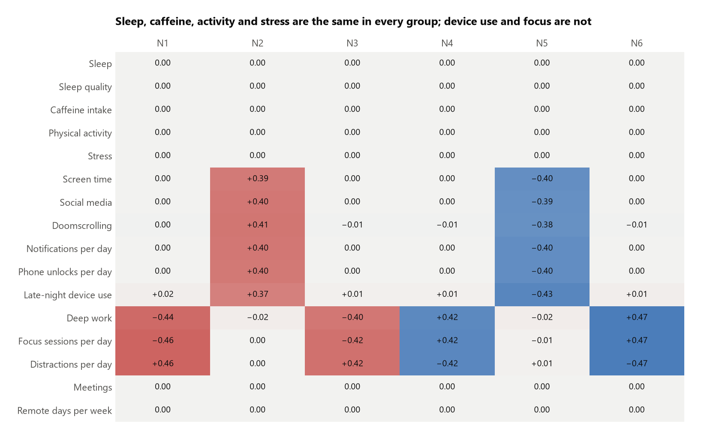
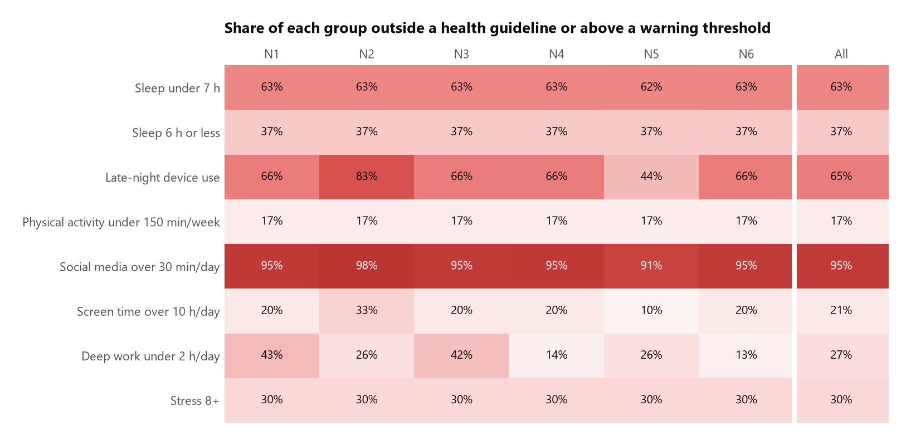
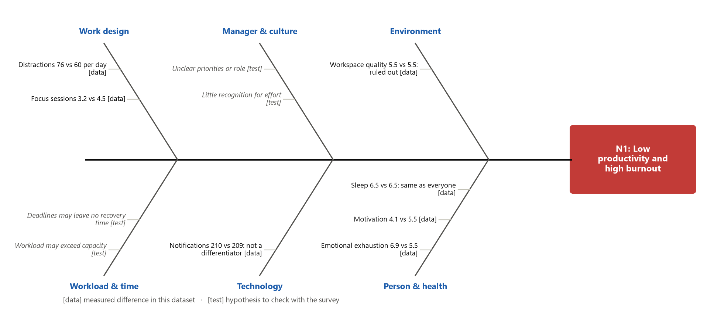
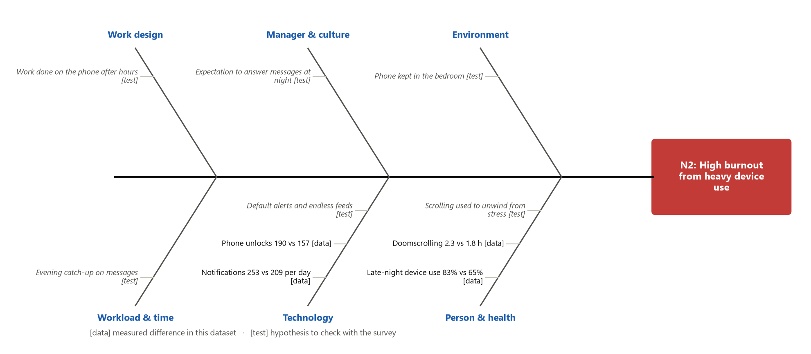
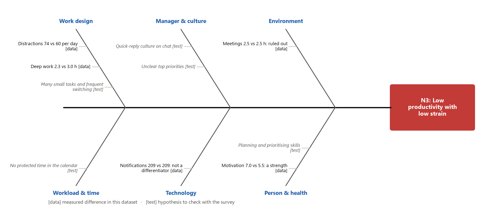
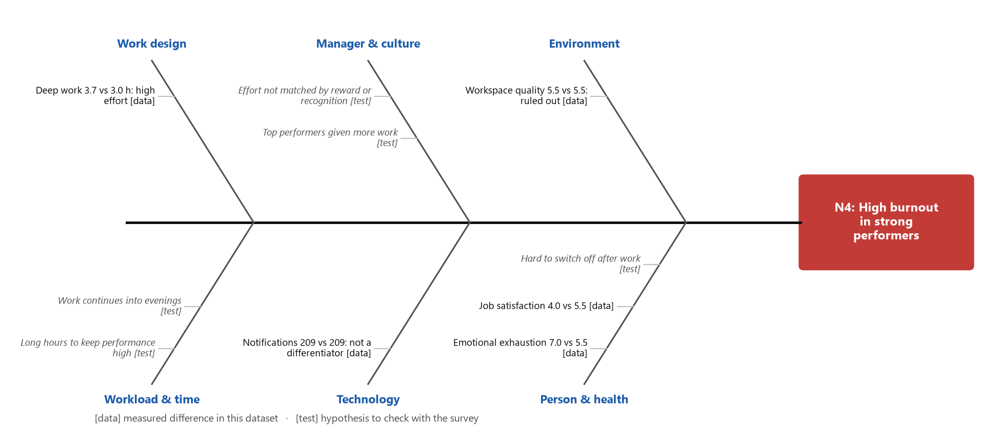
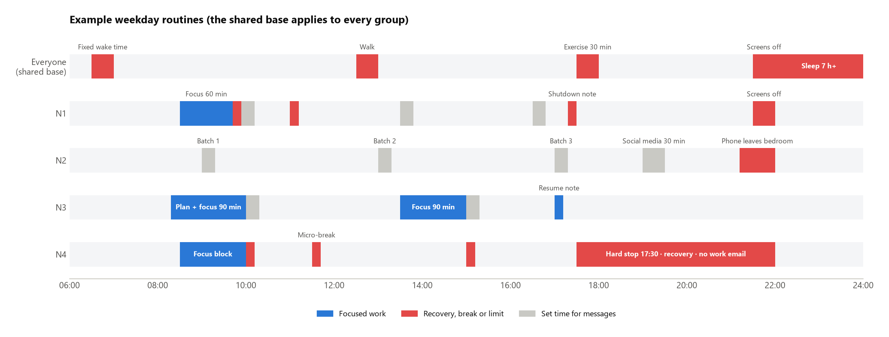
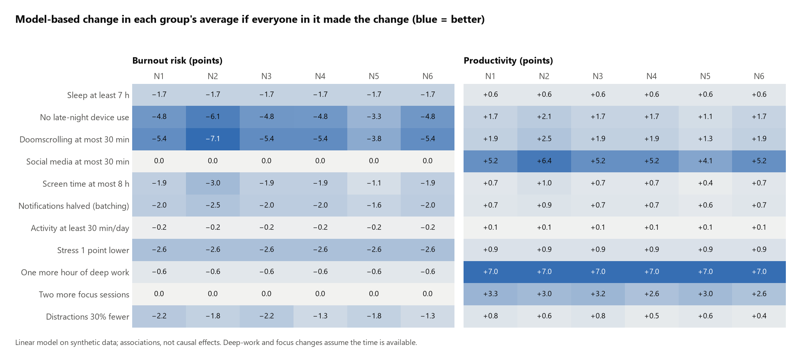

# Phase 2: Why the groups have their problems, and what each person can change

Phase 1 split 5 million employees into six groups by the problems they share. Phase 2 asks three follow-up
questions:

1. What do the daily lives of the groups look like?
2. What are the likely root causes of each group's problems?
3. Which personal routines fit each group, and what does each change cost and give back?

| Deliverable | What it is |
|---|---|
| [Phase 2 notebook](phase2_lifestyle_root_causes.ipynb) | The data work: lifestyle profile, guideline checks, model-based benefit estimates, figures |
| [Follow-up survey](survey_questionnaire.md) | A questionnaire to test the root-cause hypotheses with real employees |
| This report | Frameworks, root causes, routines, cost and benefit, with sources |

> **Read this first.** Nobody was surveyed for this project. "Survey" in part 1 means a structured look at the
> existing 5 million records. The data is synthetic (the Kaggle author says so), so the numbers show how the method
> works; they are not findings about real people. The research sources are real and linked in the
> [references](#references).

---

## Summary

- **Most lifestyle problems are shared by everyone, not by one group.** About 63% sleep under 7 hours, 37% sleep
  6 hours or less, 17% do less than 150 minutes of activity a week and 30% report high stress. These rates are the
  same in all six groups. They need one shared routine for everyone.
- **The groups differ in three areas only:** device use, focus and mental strain. Each group gets one extra layer
  of routine aimed at its own problem.
- **The data cannot show causes.** In this dataset, habits that are linked in real life (for example late-night
  phone use and shorter sleep) are unrelated. The root causes below are therefore hypotheses built from research
  frameworks, each marked as *data-backed* or *to test*, and the [follow-up survey](survey_questionnaire.md) is
  designed to test them.
- **Several likely causes sit in the job, not the person:** workload, unclear priorities, low recognition and
  expectations to answer messages at night. The WHO defines burnout as the result of chronic *workplace* stress
  that has not been managed [1], so personal routines should be paired with changes at work.
- **In this dataset's model**, the shared routine is worth about 4.5 burnout points in every group. The device-use
  changes are worth the most for N2, and protected focus time is worth the most productivity for N1 and N3.

---

## 1. Lifestyle survey of the six groups

### What is the same, and what differs

Sleep, sleep quality, caffeine, physical activity and stress are within 0.01 standard deviations of the average in
every group. The differences are in device use (N2 highest, N5 lowest), deep work and distractions (N1 and N3 worst,
N4 and N6 best) and, from Phase 1, mental strain (N1 and N4).

### How many people meet health guidelines

| Check | Guideline | All employees | Range across groups |
|---|---|---:|---|
| Sleep under 7 hours | Adults need 7 or more hours; 6 or fewer is not enough [12] | 62.5% | 62.4–62.6% |
| Sleep 6 hours or less | same | 37.4% | 37.3–37.4% |
| Late-night device use | Turn devices off at least 30 minutes before bed [13] | 65.0% | 44.5% (N5) – 82.8% (N2) |
| Activity under 150 min/week | 150–300 minutes of moderate activity a week [17] | 17.2% | 17.1–17.3% |
| Social media over 30 min/day | About 30 min/day was the limit tested in a trial [20] | 95.0% | 90.7% (N5) – 98.2% (N2) |
| Screen time over 10 h/day | — | 20.6% | 10.2% (N5) – 32.8% (N2) |
| Deep work under 2 h/day | — | 27.4% | 12.8% (N6) – 43.5% (N1) |
| Stress 8 or more | Phase 1 warning threshold | 30.0% | 29.9–30.1% |

The dataset file does not state the unit of the caffeine column, so it is not checked against the FDA's reference
amount of 400 mg a day, which the FDA describes as about two to three 12-ounce cups of coffee [15].

### A typical day for each group

| Measure (daily average) | N1 | N2 | N3 | N4 | N5 | N6 | All |
|---|---:|---:|---:|---:|---:|---:|---:|
| Sleep (h) | 6.5 | 6.5 | 6.5 | 6.5 | 6.5 | 6.5 | 6.5 |
| Physical activity (h) | 1.2 | 1.2 | 1.2 | 1.2 | 1.2 | 1.2 | 1.2 |
| Screen time (h) | 8.0 | **9.0** | 8.0 | 8.0 | 7.0 | 8.0 | 8.0 |
| Social media (h) | 3.5 | **4.2** | 3.5 | 3.5 | 2.8 | 3.5 | 3.5 |
| Doomscrolling (h) | 1.8 | **2.3** | 1.8 | 1.8 | 1.4 | 1.8 | 1.8 |
| Notifications | 210 | **253** | 209 | 209 | 165 | 209 | 209 |
| Late-night device use | 66% | **83%** | 66% | 66% | 44% | 66% | 65% |
| Deep work (h) | **2.3** | 3.0 | **2.4** | 3.7 | 3.0 | 3.8 | 3.0 |
| Focus sessions | **3.2** | 4.5 | **3.3** | 5.7 | 4.5 | 5.8 | 4.5 |
| Distractions | **76** | 60 | **74** | 45 | 60 | 44 | 60 |
| Meetings (h) | 2.5 | 2.5 | 2.5 | 2.5 | 2.5 | 2.5 | 2.5 |

Bold marks the values that set a group apart. Meetings and remote days are the same everywhere, so they are ruled
out as causes of the differences between groups.

---

## 2. Frameworks used to look for causes

| Framework | What it asks | How it is used here |
|---|---|---|
| **5 Whys** [2] | Ask "why?" repeatedly until the answer is a cause that can be acted on | A causal chain per group, from the outcome to a root cause |
| **Fishbone (Ishikawa) diagram** [3] | Sort possible causes into categories so none is missed | Six categories adapted to work: work design, workload and time, manager and culture, technology, environment, person and health |
| **SWOT** [4] | Strengths and weaknesses (inside), opportunities and threats (outside) | What each group can build on, and what in the organisation helps or blocks change |
| **Job Demands–Resources (JD-R)** [5] | High demands drain energy; resources (support, control, feedback) protect it and drive engagement | Is the problem too many demands, too few resources, or both? |
| **Effort–Reward Imbalance (ERI)** [6] | High effort with low reward (pay, esteem, recognition) is a strong stressor | Explains strain in groups that work hard (N4) |
| **Areas of Worklife** [7] | Burnout grows from mismatches in workload, control, reward, community, fairness and values | A checklist of work-side causes |
| **Stressor–Detachment model** [8] | Work stress makes it harder to switch off after work, which blocks recovery | Explains why evening habits matter for burnout |
| **COM-B** [9] | Behaviour needs Capability, Opportunity and Motivation | Decides whether a person needs a skill, a change at work, or a reason to change |
| **Self-Determination Theory** [10] | Autonomy, competence and relatedness support motivation and wellbeing | Explains low motivation in N1 and N4 |

In this report the frameworks are combined as follows: the fishbone and 5 Whys generate and order possible causes;
JD-R, ERI, Areas of Worklife and the stressor–detachment model show which causes have research support; COM-B turns
each cause into the kind of support a person needs. A large Gallup study adds a practical list of the most common
work-side causes of burnout: unfair treatment, unmanageable workload, lack of role clarity, lack of communication and
support from the manager, and unreasonable time pressure [11].

### What the data can and cannot show

A chain such as "late-night phone use → shorter sleep → burnout" needs each link to appear in the data. In this
dataset the links between habits are all close to zero (|r| < 0.01; notebook section B), even where research shows a
clear link, such as evening screen light delaying sleep [16] or caffeine up to six hours before bed shortening
sleep [14]. So every cause below is marked:

- **[data]** — a measured difference between this group and all employees;
- **[test]** — a hypothesis from the frameworks above, to be checked with the [follow-up survey](survey_questionnaire.md)
  (codes H1–H12).

---

## 3. Root causes by group

### N1 — Low focus + mental strain (very high risk, 16.7%)

Burnout 58.9 and productivity 49.5 (all employees: 48.6 and 71.4).

**5 Whys**

| Why? | Answer | Evidence |
|---|---|---|
| Why is productivity low? | Little deep work: 2.3 h a day, and 43% do less than 2 h | [data] |
| Why is there little deep work? | The day is broken up: 76 distractions and 3.2 focus sessions a day (all: 60 and 4.5) | [data] |
| Why is the day broken up? | No protected focus time, and switching between unclear priorities | [test] H2, H9 |
| Why is this hard to fix on their own? | Low energy and motivation: emotional exhaustion 6.9 and motivation 4.1 (all: 5.5 and 5.5) | [data] |
| Why is energy low? | Workload above capacity with little recognition — a JD-R and ERI pattern | [test] H1, H3 |

**SWOT**

| Strengths | Weaknesses |
|---|---|
| Device use is average, so digital habits are not the main problem | Fragmented days, low focus, low motivation and high exhaustion at the same time |
| **Opportunities** | **Threats** |
| Small structural changes (one protected block a day, clearer priorities) can address focus and strain together | Asking an exhausted person to add many new habits may backfire; burnout risk may turn into sick leave or leaving |

**Framework reading.** JD-R: high demands and low resources together. COM-B: all three parts are weak (capability:
attention; opportunity: interruptions; motivation: low), so change should start with one small, easy step and
support from the manager.

### N2 — Heavy device use (high risk, 16.6%)

Burnout 54.6, productivity 67.9.

**5 Whys**

| Why? | Answer | Evidence |
|---|---|---|
| Why is burnout risk high? | More late-night device use (83% vs 65%) and doomscrolling (2.3 h vs 1.8 h) | [data] |
| Why so much device use? | 253 notifications and 190 phone unlocks a day (all: 209 and 157) | [data] |
| Why so many notifications? | Default alerts on for all apps, phone kept in the bedroom | [test] H6 |
| Why check at night? | Some of it is work: catching up on messages, or an expectation to reply after hours | [test] H4, H5 |
| Why does it continue? | Scrolling is used to unwind from stress, which becomes a habit | [test] H7 |

**SWOT**

| Strengths | Weaknesses |
|---|---|
| Focus and mental state are close to average; productivity is only slightly below average | Highest screen time, notifications and late-night use of all groups |
| **Opportunities** | **Threats** |
| Device settings (batching, limits, phone out of the bedroom) are cheap and quick to change | A team culture of late-night replies would undo personal limits [32] |

**Framework reading.** Stressor–detachment model: evening device use keeps work and stress "on", which blocks
recovery [8]. COM-B: the main gap is opportunity (default settings, team norms) and automatic motivation (habit),
not capability.

### N3 — Low focus + low mental strain (high risk, 16.7%)

Burnout 41.2 (below average), productivity 63.8.

**5 Whys**

| Why? | Answer | Evidence |
|---|---|---|
| Why is productivity low? | Little deep work: 2.4 h a day, and 42% do less than 2 h | [data] |
| Why is there little deep work? | 74 distractions and 3.3 focus sessions a day | [data] |
| Why so many distractions? | Frequent task switching, driven by a quick-reply chat culture | [test] H8 |
| Why is time not protected? | No blocked focus time in the calendar | [test] H9 |
| Why does it persist? | Planning and prioritising skills have not been trained | [test] H10 |

**SWOT**

| Strengths | Weaknesses |
|---|---|
| High motivation (7.0) and job satisfaction (7.1); low exhaustion | Fragmented attention and little deep work |
| **Opportunities** | **Threats** |
| Motivated people take up new work methods more easily | Mislabelling this group as "burnout risk" and offering wellbeing programmes would miss the actual problem |

**Framework reading.** This is a work-method problem, not a wellbeing problem. Task-switching research shows that
switching costs time and that unfinished tasks leave "attention residue" that lowers performance on the next task
[22, 24]. COM-B: capability (planning skills) and opportunity (interruptions); motivation is already present.

### N4 — Mental strain + strong focus (high risk, 16.8%)

Burnout 55.8, productivity 80.4 (above average).

**5 Whys**

| Why? | Answer | Evidence |
|---|---|---|
| Why is burnout risk high? | High emotional exhaustion (7.0) and low job satisfaction (4.0) | [data] |
| Why exhausted while performing well? | High, sustained effort: 3.7 h of deep work and 5.7 focus sessions a day | [data] |
| Why is the effort not paying off in satisfaction? | Effort is not matched by recognition or reward | [test] H3 |
| Why does effort keep rising? | Strong performers are given more work; work continues into evenings | [test] H1, H12 |
| Why no recovery? | It is hard to switch off after work | [test] H11 |

**SWOT**

| Strengths | Weaknesses |
|---|---|
| Strong focus and task completion (77.5% vs 70%) | Half report high emotional exhaustion; low motivation (4.0) |
| **Opportunities** | **Threats** |
| Recognition and workload are within management's control | High performers who burn out may leave; this group is easy to miss if only productivity is tracked |

**Framework reading.** Effort–reward imbalance [6] and lack of detachment [8]. COM-B: capability is high; the gap is
opportunity (workload, recognition) and the ability to stop.

### N5 and N6 — low risk (33% together)

N5 stands out for light device use; N6 for strong focus and low strain. Neither needs a group-specific routine.
Their habits are useful as examples: N5 for device habits (N2), N6 for focus habits (N1, N3).

---

## 4. Personal routines

### Shared base for everyone

These address the problems that are the same in every group.

| Habit | Why | Source |
|---|---|---|
| Keep the same wake-up time every day, including weekends, and allow 7 or more hours in bed | Adults need 7+ hours; 6 or fewer is not enough. A regular schedule is a basic CDC sleep tip | [12, 13] |
| No caffeine in the afternoon or evening | 400 mg of caffeine taken 6 hours before bed reduced measured sleep by more than an hour in a lab study | [13, 14] |
| Devices off at least 30 minutes before bed | Reading on a light-emitting screen before bed delayed sleep and the body clock and reduced next-morning alertness compared with a printed book | [13, 16] |
| 150–300 minutes of moderate activity a week (for example 30 minutes on 5 days) | WHO guideline; a large review found physical activity reduces symptoms of depression and anxiety | [17, 18] |
| About 10 minutes a day of a stress skill (for example the WHO's *Doing What Matters* exercises, or mindfulness practice) | The WHO guide is a free self-help programme; mindfulness programmes gave moderate reductions in stress in healthy adults | [30, 31] |

### Group layers

**N1 — start small, then build**

| When | What | Why |
|---|---|---|
| Evening before | Write an if-then plan: "If it is 8:30, then I start the report before opening email" | If-then plans had a medium-to-large effect on reaching goals across 94 tests [27] |
| Morning | One 60-minute focus block before messages | Protects the time lost to 76 daily distractions |
| During the day | Check messages at set times; take a 5–10 minute break after each focus block | Breaks raised energy and reduced fatigue in a meta-analysis (small effects) [29] |
| End of day | 5-minute shutdown note: what is done, where to restart tomorrow | A "ready-to-resume" note reduced attention residue [25] and supports switching off [8] |
| Monthly | 1:1 with manager on workload and priorities | Workload and role clarity are among the top causes of burnout [11] |

**N2 — change the settings, then the habit**

| When | What | Why |
|---|---|---|
| Once (10 min) | Batch notifications to 3 set times a day; keep calls and a short VIP list | Batching 3 times a day lowered stress in a trial; turning all alerts off raised anxiety instead [19] |
| Daily | Check email 3 times a day | Limiting email checks lowered daily stress [21] |
| Daily | Social media capped at 30 minutes (use the phone's app limits) | Limiting three platforms to 10 minutes each for 3 weeks reduced loneliness and depression in students [20] |
| Evening | Phone charges outside the bedroom; devices off 30 minutes before bed | CDC advice; evening screen light delays sleep [13, 16] |
| When the urge comes | If-then plan: "If I reach for my phone in bed, then I read a paper book" | Replaces the habit instead of relying on willpower [27] |
| Team | Agree when messages need a reply outside working hours | The expectation to monitor email after hours was linked to worse health and relationships [32] |

**N3 — protect time for deep work**

| When | What | Why |
|---|---|---|
| Start of day | 10 minutes to choose the day's top task | Addresses planning (H10) |
| Morning and afternoon | Two 90-minute focus blocks in the calendar, chat on "do not disturb" | Switching between tasks costs time, more for complex tasks [22]; interrupted people work faster but with more stress [23] |
| Between blocks | Answer messages in one batch | Fewer switches, less attention residue [24] |
| When interrupted | Write a one-line "ready-to-resume" note | Reduced attention residue and improved performance on the interrupting task [25] |
| Team | Shared quiet hours | Changing how a software team used its time raised collective productivity [26] |

**N4 — protect recovery**

| When | What | Why |
|---|---|---|
| Daily | A fixed end time and a shutdown note; no work email in the evening | Switching off mentally is the core of recovery from job stress [8, 32] |
| During long focus blocks | 5–10 minute breaks | Small but measurable gains in energy and less fatigue [29] |
| Evening | An activity that is absorbing or relaxing (sport, a hobby, time with people) | Relaxation and "mastery" activities are measured recovery experiences [33]; exercise reduces anxiety and depression symptoms [18] |
| Monthly | Talk with the manager about workload and recognition, not only output | Effort–reward imbalance [6]; autonomy and recognition support motivation [10] |
| If exhaustion stays high for weeks | Use the employee assistance programme or a health professional | Burnout is a workplace issue, but persistent symptoms deserve professional help [1] |

### Making a routine stick

- **Start with one change.** In COM-B terms, a person with low capability or motivation (N1) should not start with
  five new habits [9]. Use the survey's Part F to pick the change the person is most ready for.
- **Use if-then plans** for the first weeks [27].
- **Expect it to take about two months.** In a real-world study, the median time for a new daily behaviour to become
  automatic was 66 days, with a range of 18 to 254 days; missing a single day did not undo progress [28].

---

## 5. Cost and benefit of each change

### Benefit estimated from this dataset

A linear model of each outcome on all measures fits this dataset well (R² ≈ 0.79 for burnout and 0.82 for
productivity). Applying each change to every member of a group and re-predicting gives the figure above. These are
associations in synthetic data, and they assume everyone makes the change in full, so treat them as a way to
**rank** changes, not as promises.

| Group | Routine bundle | Burnout now → change | Productivity now → change |
|---|---|---|---|
| N1 | Shared base + more deep work, fewer distractions, more focus sessions | 58.9 → −7.3 | 49.5 → +12.6 |
| N2 | Shared base + device changes (late night, doomscrolling, social media, screen time, notifications) | 54.6 → −23.0 | 67.9 → +13.9 |
| N3 | Shared base + more deep work, fewer distractions, more focus sessions | 41.2 → −7.3 | 63.8 → +12.2 |
| N4 | Shared base + no late-night device use | 55.8 → −9.3 | 80.4 → +2.9 |
| N5, N6 | Shared base | 42.6 / 38.4 → −4.5 | 76.2 / 90.9 → +1.5 / +1.1 |

The N2 figure is large because it stacks five device changes that each carry weight in the model; real adherence
will be partial. For N1 and N3, the productivity gain depends on actually freeing one more hour for deep work, which
usually needs a change in meetings or workload, not only personal effort.

### Cost of each change for the person

Time and money costs are estimates for a typical office worker. The evidence column lists what studies found; the
last column is this dataset's model estimate for the group the change mainly targets.

| Change | Time | Money | Downsides and risks | Evidence | Model estimate |
|---|---|---|---|---|---|
| Sleep 7 h+ with a fixed wake time | 30–60 min more in bed for those at 6–6.5 h; less evening free time | None | Fewer late evenings and weekend lie-ins | 7 h+ recommended [12]; short sleep is linked to higher mortality risk and lost productivity [34] | Burnout −1.7, productivity +0.6 (all groups) |
| No caffeine after early afternoon | None | None | Possible afternoon dip in the first days | Caffeine 6 h before bed cut sleep by over an hour [14] | Not measurable (caffeine has no link to outcomes in this data) |
| Devices off 30 min before bed; phone out of the bedroom | None (replaces screen time) | A basic alarm clock | Missing late messages; needs a replacement activity | [13, 16] | Burnout −4.8 (−6.1 for N2) |
| Activity 150 min/week | 30 min on 5 days | None (walking) to a gym fee | Time taken from other activities | [17, 18] | Burnout −0.2 (few people are below the line in this data) |
| Stress skill, 10 min/day | 10 min/day | None (free WHO guide) | Takes practice before it helps | [30, 31] | Stress −1 point → burnout −2.6 |
| Notifications batched 3 times a day | 10 min set-up | None | Risk of missing something urgent → keep calls and a VIP list; do not switch all alerts off [19] | [19] | Burnout −2.0 (−2.5 for N2) |
| Email checked 3 times a day | Saves time | None | Colleagues need to know your reply times | [21] | Included in "fewer distractions" |
| Social media ≤ 30 min/day | Frees about 3 h/day on average | None | Less entertainment and online contact; some fear of missing out at first | [20] | Productivity +5.2 (+6.4 for N2); no burnout change in this data |
| Doomscrolling ≤ 30 min/day | Frees 1–2 h/day | None | Needs a replacement habit for unwinding | [8, 20] | Burnout −5.4 (−7.1 for N2) |
| Two focus blocks a day | Calendar time; slower replies during blocks | None | Needs team agreement and manager support | [22, 23, 26] | One more hour of deep work: productivity +7.0 |
| Ready-to-resume and shutdown notes | 2–5 min per switch or per day | None | Easy to forget at first | [8, 25] | Not measured in this data |
| Micro-breaks | 5–10 min per block | None | Can feel like lost time under pressure | Small gains in energy and fatigue, not in complex-task performance [29] | Not measured in this data |
| Fixed end time, no evening email (N4) | None | None | May need deadlines renegotiated; may be seen as less committed without manager support | [8, 32] | No late-night device use: burnout −4.8 |
| Monthly workload and recognition talk (N1, N4) | 30 min a month | Manager time | Only helps if workload or recognition actually change | [6, 11] | Not measured in this data |

### Cost of not changing (organisation level)

- Insufficient sleep was estimated to cost the US economy up to $411 billion a year (2.28% of GDP), and people
  sleeping under six hours had a 13% higher mortality risk than those sleeping at least seven [34].
- The WHO estimates that depression and anxiety cost about 12 billion working days and US$1 trillion in lost
  productivity worldwide each year [35].
- In Gallup's study, 23% of employees felt burned out very often or always, and another 44% sometimes [11].

---

## 6. How to confirm the causes

1. **Run the [follow-up survey](survey_questionnaire.md)** with about 385 responses per group. Each question tests a
   hypothesis (H1–H12) from section 3.
2. **Keep only confirmed causes.** Where a cause is in the job (workload, recognition, after-hours expectations),
   pair the personal routine with a change at work.
3. **Pilot for 8–12 weeks** — long enough for habits to form [28] — with a comparison group, and measure the same
   indicators before and after: burnout, deep-work hours, screen time, late-night device use, sleep hours.

## 7. Limitations

- The data is synthetic, and habits that are linked in real life are unrelated in it, so the dataset cannot confirm
  any cause.
- The model estimates are associations, assume full adherence and ignore interactions between changes.
- Several studies cited here used small or specific samples (for example 12 sleepers in the caffeine study, 143
  students in the social media study). Their direction is useful; their exact size may not transfer to other
  workplaces.
- The routines are general wellbeing and work-method habits, not medical advice.

---

## References

1. World Health Organization (2019). [Burn-out an "occupational phenomenon": International Classification of Diseases](https://www.who.int/news/item/28-05-2019-burn-out-an-occupational-phenomenon-international-classification-of-diseases).
2. Lean Enterprise Institute. [5 Whys](https://www.lean.org/lexicon-terms/5-whys/).
3. American Society for Quality. [What is a Fishbone Diagram?](https://asq.org/quality-resources/fishbone)
4. Community Tool Box, University of Kansas. [SWOT Analysis: Strengths, Weaknesses, Opportunities, and Threats](https://ctb.ku.edu/en/table-of-contents/assessment/assessing-community-needs-and-resources/swot-analysis/main).
5. Bakker, A. B., & Demerouti, E. (2007). The Job Demands-Resources model: state of the art. *Journal of Managerial Psychology*, 22(3), 309–328. [doi:10.1108/02683940710733115](https://doi.org/10.1108/02683940710733115)
6. Siegrist, J. (1996). Adverse health effects of high-effort/low-reward conditions. *Journal of Occupational Health Psychology*, 1(1), 27–41. [PubMed](https://pubmed.ncbi.nlm.nih.gov/9547031/)
7. Maslach, C., & Leiter, M. P. (2016). Understanding the burnout experience: recent research and its implications for psychiatry. *World Psychiatry*, 15(2). [Wiley](https://onlinelibrary.wiley.com/doi/full/10.1002/wps.20311)
8. Sonnentag, S., & Fritz, C. (2015). Recovery from job stress: The stressor-detachment model as an integrative framework. *Journal of Organizational Behavior*, 36, S72–S103. [Wiley](https://onlinelibrary.wiley.com/doi/abs/10.1002/job.1924)
9. Michie, S., van Stralen, M. M., & West, R. (2011). The behaviour change wheel. *Implementation Science*, 6, 42. [Springer](https://link.springer.com/article/10.1186/1748-5908-6-42)
10. Deci, E. L., Olafsen, A. H., & Ryan, R. M. (2017). Self-Determination Theory in Work Organizations: The State of a Science. *Annual Review of Organizational Psychology and Organizational Behavior*, 4, 19–43. [Annual Reviews](https://www.annualreviews.org/content/journals/10.1146/annurev-orgpsych-032516-113108)
11. Wigert, B., & Agrawal, S. (2018). [Employee Burnout, Part 1: The 5 Main Causes](https://www.gallup.com/workplace/237059/employee-burnout-part-main-causes.aspx). Gallup.
12. American Academy of Sleep Medicine (2015). [Seven or more hours of sleep per night: a health necessity for adults](https://aasm.org/seven-or-more-hours-of-sleep-per-night-a-health-necessity-for-adults/) (joint consensus with the Sleep Research Society, Watson et al., 2015).
13. Centers for Disease Control and Prevention. [About Sleep](https://www.cdc.gov/sleep/about/index.html).
14. Drake, C., Roehrs, T., Shambroom, J., & Roth, T. (2013). Caffeine effects on sleep taken 0, 3, or 6 hours before going to bed. *Journal of Clinical Sleep Medicine*, 9(11), 1195–1200. [PubMed](https://pubmed.ncbi.nlm.nih.gov/24235903/)
15. U.S. Food and Drug Administration. [Spilling the Beans: How Much Caffeine is Too Much?](https://www.fda.gov/consumers/consumer-updates/spilling-beans-how-much-caffeine-too-much)
16. Chang, A.-M., Aeschbach, D., Duffy, J. F., & Czeisler, C. A. (2015). Evening use of light-emitting eReaders negatively affects sleep, circadian timing, and next-morning alertness. *PNAS*, 112(4), 1232–1237. [PNAS](https://www.pnas.org/doi/10.1073/pnas.1418490112)
17. Bull, F. C., et al. (2020). World Health Organization 2020 guidelines on physical activity and sedentary behaviour. *British Journal of Sports Medicine*. [PubMed](https://pubmed.ncbi.nlm.nih.gov/33239350/)
18. Singh, B., et al. (2023). Effectiveness of physical activity interventions for improving depression, anxiety and distress: an overview of systematic reviews. *British Journal of Sports Medicine*, 57, 1203–1209. [PubMed](https://pubmed.ncbi.nlm.nih.gov/36796860/)
19. Fitz, N., Kushlev, K., Jagannathan, R., Lewis, T., Paliwal, D., & Ariely, D. (2019). Batching smartphone notifications can improve well-being. *Computers in Human Behavior*, 101, 84–94. [ScienceDirect](https://www.sciencedirect.com/science/article/abs/pii/S0747563219302596)
20. Hunt, M. G., Marx, R., Lipson, C., & Young, J. (2018). No More FOMO: Limiting Social Media Decreases Loneliness and Depression. *Journal of Social and Clinical Psychology*, 37(10), 751–768. [Guilford](https://guilfordjournals.com/doi/10.1521/jscp.2018.37.10.751)
21. Kushlev, K., & Dunn, E. W. (2015). Checking email less frequently reduces stress. *Computers in Human Behavior*, 43, 220–228. [ScienceDirect](https://www.sciencedirect.com/science/article/abs/pii/S0747563214005810)
22. American Psychological Association. [Multitasking: Switching costs](https://www.apa.org/topics/research/multitasking) (summarising Rubinstein, Meyer & Evans, 2001).
23. Mark, G., Gudith, D., & Klocke, U. (2008). The cost of interrupted work: more speed and stress. *Proceedings of CHI 2008*, 107–110. [ACM](https://dl.acm.org/doi/10.1145/1357054.1357072)
24. Leroy, S. (2009). Why is it so hard to do my work? The challenge of attention residue when switching between work tasks. *Organizational Behavior and Human Decision Processes*, 109(2), 168–181. [RePEc](https://ideas.repec.org/a/eee/jobhdp/v109y2009i2p168-181.html)
25. Leroy, S., & Glomb, T. M. (2018). Tasks Interrupted: How Anticipating Time Pressure on Resumption of an Interrupted Task Causes Attention Residue and Low Performance on Interrupting Tasks and How a "Ready-to-Resume" Plan Mitigates the Effects. *Organization Science*, 29(3), 380–397. [INFORMS](https://pubsonline.informs.org/doi/10.1287/orsc.2017.1184)
26. Perlow, L. A. (1999). The Time Famine: Toward a Sociology of Work Time. *Administrative Science Quarterly*, 44(1), 57–81. [SAGE](https://journals.sagepub.com/doi/10.2307/2667031)
27. Gollwitzer, P. M., & Sheeran, P. (2006). Implementation intentions and goal achievement: A meta-analysis of effects and processes. *Advances in Experimental Social Psychology*, 38, 69–119. [ScienceDirect](https://www.sciencedirect.com/science/chapter/bookseries/abs/pii/S0065260106380021)
28. Lally, P., van Jaarsveld, C. H. M., Potts, H. W. W., & Wardle, J. (2010). How are habits formed: Modelling habit formation in the real world. *European Journal of Social Psychology*, 40(6), 998–1009. [Wiley](https://onlinelibrary.wiley.com/doi/abs/10.1002/ejsp.674)
29. Albulescu, P., et al. (2022). "Give me a break!" A systematic review and meta-analysis on the efficacy of micro-breaks for increasing well-being and performance. *PLOS ONE*, 17(8), e0272460. [PLOS](https://journals.plos.org/plosone/article?id=10.1371/journal.pone.0272460)
30. Khoury, B., Sharma, M., Rush, S. E., & Fournier, C. (2015). Mindfulness-based stress reduction for healthy individuals: A meta-analysis. *Journal of Psychosomatic Research*, 78(6), 519–528. [ScienceDirect](https://www.sciencedirect.com/science/article/abs/pii/S002239991500080X)
31. World Health Organization (2020). [Doing What Matters in Times of Stress: An Illustrated Guide](https://www.who.int/publications-detail-redirect/9789240003927).
32. Becker, W. J., Belkin, L. Y., Conroy, S. A., & Tuskey, S. (2021). Killing Me Softly: Organizational E-mail Monitoring Expectations' Impact on Employee and Significant Other Well-Being. *Journal of Management*, 47(4), 1024–1052. [SAGE](https://journals.sagepub.com/doi/abs/10.1177/0149206319890655)
33. Sonnentag, S., & Fritz, C. (2007). The Recovery Experience Questionnaire: development and validation of a measure for assessing recuperation and unwinding from work. *Journal of Occupational Health Psychology*, 12(3), 204–221. [PubMed](https://pubmed.ncbi.nlm.nih.gov/17638488/)
34. Hafner, M., Stepanek, M., Taylor, J., Troxel, W. M., & van Stolk, C. (2016). [Why sleep matters — the economic costs of insufficient sleep](https://www.rand.org/pubs/research_reports/RR1791.html). RAND Corporation.
35. World Health Organization. [Mental health at work](https://www.who.int/news-room/fact-sheets/detail/mental-health-at-work) (fact sheet).
36. Schaufeli, W. B., De Witte, H., & Desart, S. (2020). [Burnout Assessment Tool (BAT)](https://burnoutassessmenttool.be/start_eng/). KU Leuven.
37. Cohen, S., Kamarck, T., & Mermelstein, R. (1983). A global measure of perceived stress. *Journal of Health and Social Behavior*, 24(4), 385–396. [Scale page, Carnegie Mellon University](https://www.cmu.edu/dietrich/psychology/stress-immunity-disease-lab/scales/index.html)
38. Craig, C. L., et al. (2003). International Physical Activity Questionnaire: 12-country reliability and validity. *Medicine & Science in Sports & Exercise*, 35(8), 1381–1395. [PubMed](https://pubmed.ncbi.nlm.nih.gov/12900694/)
